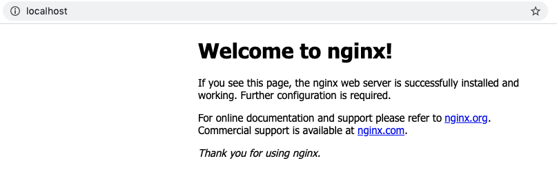

# Provision an Infrastructure with Terraform
Terraform is a tool for building, changing, and versioning infrastructures.
A key feature is Infrastructure as Code (IaC). This feature allows operators to manage their
desired resources, such as a virtual machine or network interface, on almost any provider, including AWS, GitHub, and Docker.
A provider is responsible for understanding API interactions and managing resources.


## Learning Objectives
In this tutorial, you will be able to provision and destroy a Nginx webserver using Terraform and Docker. 


## Prerequisites 
- [Terraform](https://www.terraform.io/downloads.html)
- [Docker](https://www.docker.com/products/docker-desktop) 


## Installing Terraform 
To install Terraform, download the [appropriate package](https://www.terraform.io/downloads.html) for your operating system. 

Once the download is complete, unzip the package. 

The final step is to move Terraform to the correct `PATH` directory.
- [How to set PATH on Windows](https://stackoverflow.com/questions/1618280/where-can-i-set-path-to-make-exe-on-windows) 
- [How to set PATH on Linux and Mac](https://stackoverflow.com/questions/14637979/how-to-permanently-set-path-on-linux-unix)

To verify that you've installed Terraform, run the ```terraform``` command. 
```shell
$ terraform
```
If you received an error that ```terraform``` could not be found, please check to see if Terraform is in the correct ```PATH```.
```shell 
$ terraform: command not found
```

Upon successful installation, your terminal should look like this. 
```
$ Usage: terraform [-version] [-help] <command> [args]

The available commands for execution are listed below.
The most common, useful commands are shown first, followed by
less common or more advanced commands. If you're just getting
started with Terraform, stick with the common commands. For the
other commands, please read the help and docs before usage.

Common commands:
    apply              Builds or changes infrastructure
    console            Interactive console for Terraform interpolations
    destroy            Destroy Terraform-managed infrastructure

...
```


## Set Up Directory
Now that you have Terraform installed, you are ready to create infrastructure. 

To start, open your terminal and create a new directory.
```shell 
$ mkdir terraform-demo 
```

Enter into the directory.
```shell 
$ cd terraform-demo 
```

Create a new file for your configuration code. 
```shell
$ touch main.tf 
```


## Configure Provider
The first step to using Terraform is to configure the provider(s) you want to use.
We will use the [Docker Provider](https://www.terraform.io/docs/providers/docker/index.html). 


To start, paste the following lines into ```main.tf```:

```hcl
# Configure the Docker provider 
provider "docker" {
    host = "unix:///var/run/docker.sock"
}


# Create a container 
resource "docker_container" "nginx" {
  image = docker_image.nginx.latest
  name  = "training"
  ports {
    internal = 80
    external = 80
  }
}

resource "docker_image" "nginx" {
  name = "nginx:latest"
}
```


## Initialize Infrastructure
To install the provider and initialize the server, enter the ```init``` command.
```shell
$ terraform init
``` 

You should see this after your command has successfully ran.
```shell
$ ...

Terraform has been successfully initialized!

You may now begin working with Terraform. Try running "terraform plan" to see
any changes that are required for your infrastructure. All Terraform commands
should now work.

If you ever set or change modules or backend configuration for Terraform,
rerun this command to reinitialize your working directory. If you forget, other
commands will detect it and remind you to do so if necessary.
```


Once completed, provision the Nginx server with the ```apply``` command.
```shell
$ terraform apply
```

You will be asked to confirm your provision. Type ```yes``` and hit ENTER. 
```shell
$ Do you want to perform these actions?
  Terraform will perform the actions described above.
  Only 'yes' will be accepted to approve.

  Enter a value: 
```

This command will take up to a few minutes to run. 
Once completed, it should display a message that the resource was created. 
```shell
$ Apply complete! Resources: 2 added, 0 changed, 0 destroyed.
```

To check that you've successfully created an instance, enter `localhost` in your browser.



Alternatively, run the `docker ps` command in your terminal.
```shell
$ docker ps

CONTAINER ID        IMAGE               COMMAND                  CREATED             STATUS              PORTS                NAMES
319d42cf1dc5        e791337790a6        "nginx -g 'daemon of…"   23 minutes ago      Up 23 minutes       0.0.0.0:80->80/tcp   training
```


## Destroy Infrastructure
To stop your server or destroy its resources, run the ```destroy``` command.
```shell 
$ terraform destroy 
```

You will be prompted with a confirmation message in your terminal. Type ```yes``` and hit ENTER.
```shell
$ Do you really want to destroy all resources?
  Terraform will destroy all your managed infrastructure, as shown above.
  There is no undo. Only 'yes' will be accepted to confirm.

  Enter a value: 
```
Upon completion, you will see this message.
```shell 
$ Destroy complete! Resources: 2 destroyed.
```


## Next Steps 
In this guide, you built and destroyed a Nginx server using Terraform and Docker.
This involved installing Terraform in your system, setting up a directory for your configuration, 
installing the Docker provider and resources, and using Terraform functionality to manage your infrastructure.

Now you can build and destroy Terraform-managed infrastructures through the CLI.

To learn more about Terraform commands, run the ```help``` command in your terminal.
```shell
$ terraform -help
```

To learn how you can use Terraform to change and manage infrastructures, follow the [Change Infrastructure Track](https://learn.hashicorp.com/terraform/getting-started/change).

To explore other tools to provision, secure, and deploy infrastructures, see [HashiCorp Learn](https://learn.hashicorp.com/).

